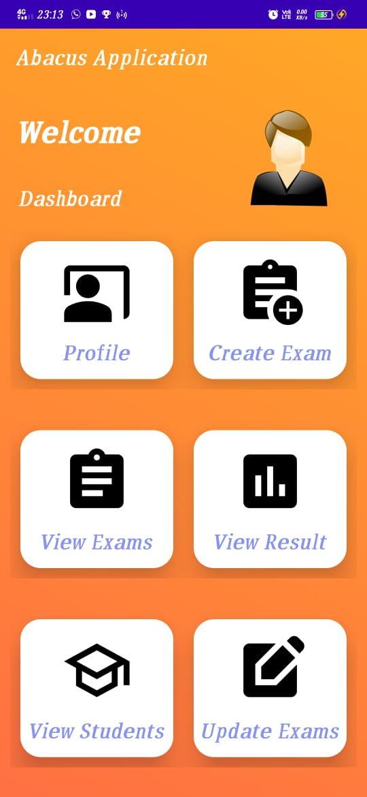
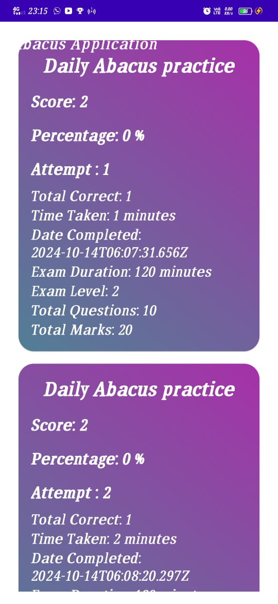

<h1>🧮 Abacus Exam Mobile Application</h1>

<h2>🔗 Project Links</h2>
<ul>
<li>Backend Repository: https://github.com/AnkitBorude/Abacus-Exam-System-REST-API</li>
</ul>
<h2>📝 Project Overview</h2>

Android mobile application for Abacus Exam System, interfacing with REST API for comprehensive exam management.

<h2>🔑 Service Files Architecture</h2>
<h3>Key Service Components</h3>
<ul>
<li><strong>ApiEndpointsService.java</strong>
<ul>
<li>Defines all REST API endpoint interfaces</li>
<li>Contains method declarations for API interactions</li>
<li>Located in: <code>com.example.abacusapplication/services/</code></li>
</ul>
</li>
<li><strong>RetrofitClientFactory.java</strong>
<ul>
<li>Creates Retrofit client from base URL</li>
<li>Configurable server endpoint connection</li>
<li>Generates Retrofit instance for API calls</li>
</ul>
</li>
<li><strong>AuthInterceptorService.java</strong>
<ul>
<li>Intercepts HTTP requests</li>
<li>Automatically appends Bearer authentication token</li>
<li>Ensures secure authenticated requests</li>
</ul>
</li>
</ul>
<h2>✨ Features</h2>
<table align="center">
<tr>
<td align="center">🔐 Secure Authentication</td>
<td align="center">📋 Exam Management Interface</td>
<td align="center">📥 PDF Report Download</td>
</tr>
<tr>
<td align="center">🌐 Customizable Server Connection</td>
<td align="center">🖥️ Offline LAN-Based Exams</td>
<td align="center">📊 Admin & Student Dashboards</td>
</tr>
</table>
<h2>🛠️ Tech Stack</h2>
<table align="center">
<tr>
<th>Category</th>
<th>Technologies</th>
</tr>
<tr>
<td>Language</td>
<td></td>
</tr>
<tr>
<td>UI Framework</td>
<td>Android Native</td>
</tr>
<tr>
<td>Networking</td>
<td></td>
</tr>
</table>
<h2>🚀 Technical Highlights</h2>
<ul>
<li>Retrofit Library Integration</li>
<li>HTTP Interceptor for Authentication</li>
<li>Modular Service Architecture</li>
<li>Flexible Server URL Configuration</li>
<li>Comprehensive Logging Mechanism</li>
</ul>
<h2>📦 Installation</h2>
<ol>
<li>Clone Repository
<code>git clone https://github.com/AnkitBorude/Abacus-exam-Android-app-frontend.git</code>
</li>
<li>Configure Services
<ul>
<li>Update base URL in RetrofitClientFactory</li>
<li>Configure authentication parameters</li>
</ul>
</li>
<li>Build and Run in Android Studio</li>
</ol>

<h2>📷Screenshots</h2>
<h3>Screenshot 1</h3>
    
    <h3>Screenshot 2</h3>
    
    <h3>Screenshot 3</h3>
    
    <h3>Screenshot 4</h3>
    
    <h3>Screenshot 5</h3>
    
    <h3>Screenshot 6</h3>
    
    <h3>Screenshot 7</h3>
    
    <h3>Screenshot 8</h3>
    
    <h3>Screenshot 9</h3>
    
    <h3>Screenshot 10</h3>
    
    <h3>Screenshot 11</h3>
    
    <h3>Screenshot 12</h3>
    
    <h3>Screenshot 13</h3>
    
    <h3>Screenshot 14</h3>
    
    <h3>Screenshot 15</h3>
    
    <h3>Screenshot 16</h3>
    
    <h3>Screenshot 17</h3>
    
    <h3>Screenshot 18</h3>
    
    <h3>Screenshot 19</h3>
    

<h2>🤝 Contributing</h2>
<ol>
<li>Fork the repository</li>
<li>Create feature branch</li>
<li>Implement/Fix features</li>
<li>Submit Pull Request</li>
</ol>

  <h3><b>
  Made with ❤️ by Ankit Borude
  </b></h3>

